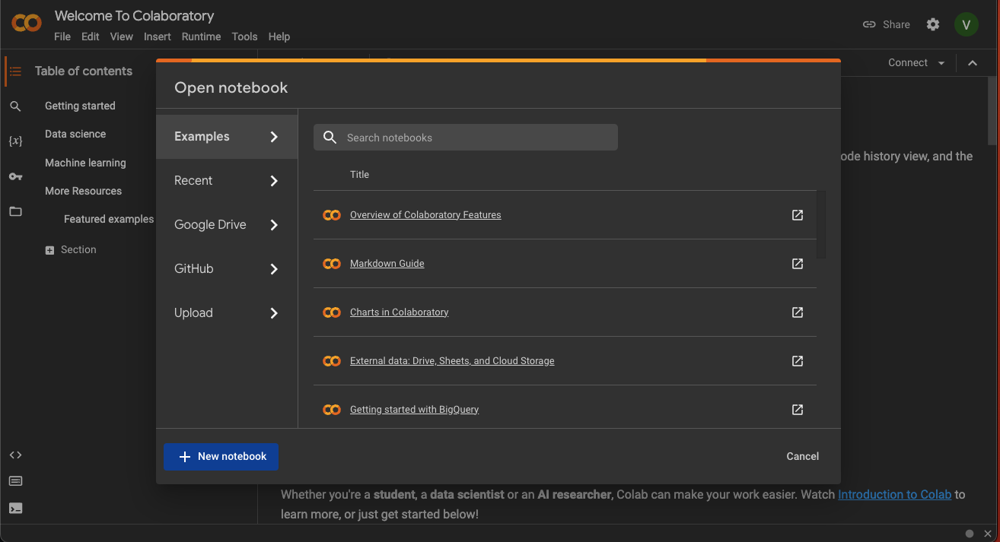
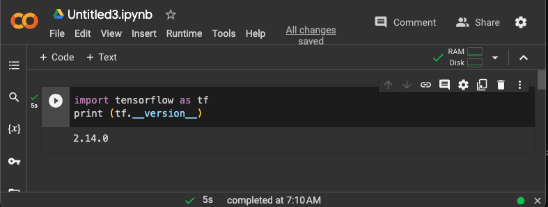
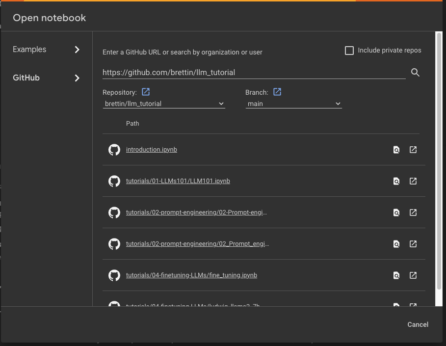

# Large Language Models (LLMs): Tutorial Workshop

[Workshop Agenda](https://anl.app.box.com/file/1421615910690?s=woqtpw0o0tpnb6j9uljjme5wqmxsoz35)  
Argonne National Laboratory  
_February 12th and 13th, 2024_  
**Building 240**, **Room 1501** (in-person)

This repository contains the materials used in the LLM Tutorial Workshop, February 12th and 13th, 2024.

The  workshop material will rely on Jupyter Notebooks which are targeted for running on [Google's Colaboratory Platform](https://colab.research.google.com).  

    
<b>Tutorials</b>

    <ol start="1.">
        <li><a href="./tutorials/01-llm-101/"><code>LLMs 101</code></a></li>
        <li><a href="./tutorials/02-basic-prompt-engineering/"><code>Basic Prompt Engineering</code></a></li>
        <li><a href="./tutorials/03-intermediate-prompt-engineering/"><code>Intermediate Prompt Engineering</code></a></li>
        <li><a href="./tutorials/04-rag/"><code>Retrieval Augmented Generation (RAG)</code></a></li>
        <li><a href="./tutorials/05-fine-tuning/"><code>Fine-Tuning an Existing LLM</code></a></li>
        <li><a href="./tutorials/06-llm-from-scratch/"><code>LLMs from Scratch</code></a></li>
    </ol>

## Before You Arrive

Do the following before you come to the tutorial:

1. [Google Colab](https://colab.research.google.com) **Setup Account**

    

<code>Google Colab Instructions</code>

    The Colab platform gives the user a virtual machine in which to run Python codes including machine
    learning codes.

    The VM comes with a preinstalled environment that includes most of what is needed
    for these tutorials.

    * You need a Google Account to use Colaboratory
    * Go to [Google's Colaboratory Platform](https://colab.research.google.com) and sign in with
      your Google account
    * You should see this page
        
    * Click on the `New Notebook` at the bottom
    * Now you will see a new notebook where you can type in python code.
        
    * After you enter code, type `<shift> + <enter>` to execute the code cell.
    * A full introduction to the notebook environment is out of scope for this tutorial, but many
      can be found with a [simple Google
      search](https://www.google.com/search?q=jupyter+notebook+tutorial)
    * We will be using notebooks from this repository during the tutorial, so  you should be
      familiar with how to import them into Colaboratory
    * Now you can open the `File` menu at the top left and select `Open Notebook` which will open a
      dialogue box.
    * Select the `GitHub` tab in the dialogue box.
    * From here you can enter the url for the github repo: `https://github.com/brettin/llm_tutorial`
      and hit `<enter>`.
        
    * This will show you a list of the Notebooks available in the repo.
    * Select the `introduction.ipynb` file to open and work through it.
    * As each session of the tutorial begins, you will simply select the corresponding notebook from
      this list and it will create a copy for you in your Colaboratory account (all `*.ipynb` files in
      the Colaboratory account will be stored in your Google Drive).
    * To use a TPU, in the notbook the select `Runtime` -> `Change Runtime Type` and you have a
      dropbox list of hardward settings to choose from where the notebook can run.

    

2. 🤗 [Hugging Face](https://huggingface.co): **Account and Access Token**

    

<code>Hugging Face Instructions</code>

    - Sign up for a huggingface account and obtain an access token: https://huggingface.co
    - Sign Up (top bar)
      Log into huggingface and get an access token:
        - Login -> Settings (left pane) -> Access Tokens (left pane) -> New token (center pane)

    

3. Request access to 🦙 Llama-2 model

    

<code>Llama-2 Access Instructions</code>

    - Visit this https://huggingface.co/meta-llama/Llama-2-7b-hf and request access to the model
    - vist meta website and accept the terms https://ai.meta.com/resources/models-and-libraries/llama-downloads/
    - Note: Your Hugging Face account email address MUST match the email you provide on the Meta website, or your request will not be approved.

    

<!--

## Contents

- 📂 [`tutorials/`](https://github.com/argonne-lcf/llm-workshop/tutorials/)  
  `├──` [`01-llm-101`](https://github.com/argonne-lcf/llm-workshop/tutorials/01-llm101/)  
  `└──` [`06-llm-from-scratch`](https://github.com/argonne-lcf/llm-workshop/tutorials/06-llm-from-scratch/)
-->
